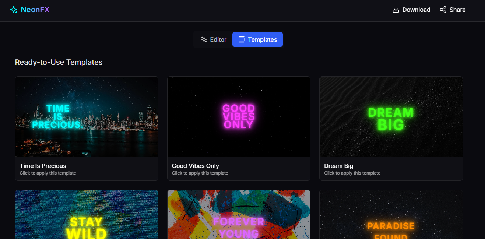

# NeonFX - Neon Text Generator

A modern, interactive web application for creating stunning neon text effects on images. Upload your photos, add customizable neon text overlays, and create eye-catching designs with a variety of fonts, colors, and glow effects.

## 🌟 Live Demo

**[View Demo](https://neon-word-base-photo-editor.vercel.app/)**



## ✨ Features

- **🎨 Drag & Drop Image Upload**: Seamlessly upload images with drag-and-drop functionality
- **✨ Neon Text Effects**: Add text with realistic neon glow effects and customizable intensity
- **🎯 Real-time Text Editing**: 
  - Customize text content, font family, size, and color
  - Adjust glow intensity and rotation
  - Drag text elements to position them perfectly
- **📱 Responsive Design**: Works beautifully on desktop, tablet, and mobile devices
- **🎭 Preview Mode**: Toggle between editing and preview modes for perfect results
- **📚 Template Gallery**: Choose from pre-designed templates to get started quickly
- **💾 Download Creations**: Save your neon text designs as high-quality PNG images
- **🎨 Color Picker**: Advanced color selection with hex color picker and preset neon colors
- **🔤 Multiple Fonts**: Choose from Inter, Righteous, Rubik Mono One, and Teko fonts

## 🚀 Getting Started

### Prerequisites

- Node.js (v16 or higher)
- npm or yarn

### Installation

1. Clone the repository:
   ```bash
   git clone https://github.com/akshayyborse/neon-word-base-photo-editor.git
   cd neon-word-base-photo-editor
   ```

2. Install dependencies:
   ```bash
   npm install
   ```

3. Start the development server:
   ```bash
   npm run dev
   ```

4. Open your browser and navigate to `http://localhost:5173`

## 📖 How to Use

### Creating Your First Neon Text Design

1. **Upload Background Image**: 
   - Drag and drop an image onto the canvas area
   - Or click to select an image from your device
   - Supported formats: PNG, JPG, JPEG, GIF, WebP

2. **Add Neon Text**:
   - Enter your text in the input field
   - Click "Add" to place it on the canvas
   - Text will appear with a random neon color

3. **Customize Your Text**:
   - **Select a text element** by clicking on it
   - **Edit text content** in the sidebar
   - **Choose a font** from the dropdown menu
   - **Pick a color** using the color picker or preset colors
   - **Adjust font size** with the slider (12px - 120px)
   - **Set rotation** angle (-180° to 180°)
   - **Control glow intensity** (0.2 - 1.5)

4. **Position Your Text**:
   - Drag text elements around the canvas
   - Click and drag to move them to the perfect position

5. **Preview and Download**:
   - Toggle "Preview Mode" to see your final design
   - Click the download button to save as PNG

### Using Templates

1. Switch to the "Templates" tab
2. Browse through pre-designed templates
3. Click on any template to apply it to your canvas
4. Customize the template elements as needed

## 🛠️ Technologies Used

- **React 18** - Modern React with hooks and functional components
- **TypeScript** - Type-safe development
- **Vite** - Fast build tool and development server
- **Tailwind CSS** - Utility-first CSS framework
- **Framer Motion** - Smooth animations and drag interactions
- **React Dropzone** - File upload functionality
- **React Colorful** - Advanced color picker
- **Lucide React** - Beautiful icons
- **HTML-to-Image** - Image export functionality

## 🎨 Design Features

- **Dark Theme**: Modern dark interface with neon accents
- **Glass Morphism**: Beautiful glass panel effects
- **Smooth Animations**: Framer Motion powered interactions
- **Neon Color Palette**: Pre-selected neon colors for authentic effects
- **Responsive Layout**: Adapts to any screen size

## 📱 Browser Support

- Chrome (recommended)
- Firefox
- Safari
- Edge

## 🚀 Deployment

This project is deployed on Vercel and can be easily deployed to any static hosting service.

### Build for Production

```bash
npm run build
```

The build output will be in the `dist` directory.

## 🤝 Contributing

1. Fork the repository
2. Create your feature branch (`git checkout -b feature/AmazingFeature`)
3. Commit your changes (`git commit -m 'Add some AmazingFeature'`)
4. Push to the branch (`git push origin feature/AmazingFeature`)
5. Open a Pull Request

## 📄 License

This project is licensed under the MIT License - see the [LICENSE](LICENSE) file for details.

## 🙏 Acknowledgments

- **Google Fonts** for the beautiful typography
- **Lucide React** for the amazing icons
- **Vercel** for hosting and deployment
- **Framer Motion** for smooth animations
- **React Dropzone** for seamless file uploads

## 📞 Support

If you have any questions or need help, feel free to open an issue on GitHub.

---

**Made with ❤️ by [Akshay Borse](https://github.com/akshayyborse)**
